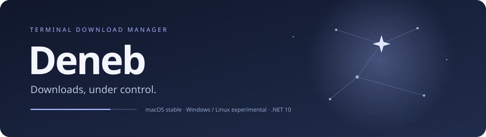

[English](README.md) · **Русский**

<p align="center">
  
</p>

<p align="center">
  <a href="https://github.com/yazovskiy/Deneb/releases/latest"></a>
  
  <a href="https://github.com/yazovskiy/Deneb/releases/tag/v2.0.0-experimental.1"></a>
  
  <a href="LICENSE"></a>
</p>

<p align="center"><b>Полноэкранный менеджер загрузок для вашего терминала.</b><br>
Очередь, параллельные соединения и безопасная докачка — без браузера, с фоновым процессом.</p>

<p align="center">
  <a href="https://github.com/yazovskiy/Deneb/releases/latest/download/deneb-osx-arm64.tar.gz"><b>↓ Скачать для macOS Apple Silicon</b></a>
  &nbsp; · &nbsp; <a href="docs/usage.ru.md">Руководство</a>
  &nbsp; · &nbsp; <a href="CHANGELOG.md">Что нового</a>
</p>

## Deneb 2.1: место и общий лимит скорости (подготовка релиза)

В **F2 → Общий лимит скорости** задайте число в КиБ/с или МиБ/с. Дробные числа вводятся по выбранному языку; `0` — без ограничения. Лимит общий для всех задач, применяется после сохранения без перезапуска передач и отображается внизу. Ограничиваются читаемые байты тела HTTP-ответа, не заголовки, TLS или буферы ОС. Сборка и вычисление хеша не замедляются.

До загрузки известного размера проверяется место на **остаток частей и полную сборку**, с общим запасом **512 МиБ на том**. Резервы активных задач учитываются вместе; уже записанные части повторно не считаются. Для неизвестного размера проверка идёт по мере записи. Место повторно проверяется во время передачи и перед сборкой. Это логический резерв, не физическое выделение: внешние записи, общие пулы хранения и квоты всё ещё могут вызвать ошибку диска.

При нехватке места задача остаётся на паузе с подтверждёнными частями. Освободите место и нажмите **Space** на этой задаче. Снятие общей паузы и перезапуск Deneb её не возобновляют. Подробности показывают последнюю проверку места; невозможность измерения сообщается отдельно.

Перед обновлением остановите старый фон. Хранилище v5 сохраняет очереди v1–v4 с отдельной резервной копией; имена и ID частей v4 не меняются, лимит по умолчанию отсутствует. IPC v2 не подключается к старому фону. Не открывайте очередь v5 в 2.0 и более ранних версиях.

Ссылки ниже ведут на опубликованные сборки 2.0 до приёмки и публикации 2.1.

## Фон и соединения

**Q / Ctrl+C закрывает только интерфейс.** Загрузки продолжаются после закрытия Terminal. Повторный запуск `deneb` подключается к очереди; **F10** останавливает весь Deneb после подтверждения.

- `deneb start` — запустить фон без интерфейса.
- `deneb status` — показать состояние, не запуская фон.
- `deneb pause` / `deneb resume` — включить / снять только общую паузу.
- `deneb stop` — сохранить прогресс и остановить фон.
- Все команды принимают `--state-dir ПУТЬ`. Разрешён один интерфейс на очередь; CLI доступен параллельно.
- При потере связи: **F11** — подключиться; **F12** — запустить фон при необходимости и подключиться. Не повторяйте команду с неизвестным результатом, пока не проверите состояние.

В F2 настройка **«Макс. соединений на файл»** применяется к активным и будущим загрузкам. Диапазон 1–16, по умолчанию 4. Отображается фактическое число / максимум. Сервер, размер меньше 16 МиБ, малый остаток или ожидание повторов могут ограничить число запросов. Изменение лимита не сбрасывает прогресс и паузы.

Перед обновлением закройте Deneb 1.x или выполните `deneb stop` для 2.x. Хранилище обновляется до v5 с отдельной копией исходной версии. Существующие части не переименовываются. **Резервная копия метаданных не гарантирует откат к 1.2 после переразбиения диапазонов.**

Автозапуск при входе, предотвращение сна и автоматический перезапуск после сбоя не включены. Фон работает до явной остановки, даже при пустой очереди.

## Скачать и выбрать платформу

| Платформа | Статус | Автономная сборка |
|---|---|---|
| macOS Apple Silicon (ARM64) | **Стабильная** | [tar.gz](https://github.com/yazovskiy/Deneb/releases/latest/download/deneb-osx-arm64.tar.gz) |
| Windows x64 | **Экспериментальная — pre-release** | [zip](https://github.com/yazovskiy/Deneb/releases/download/v2.0.0-experimental.1/deneb-win-x64-experimental.zip) |
| Linux x64 (glibc) | **Экспериментальная — pre-release** | [tar.gz](https://github.com/yazovskiy/Deneb/releases/download/v2.0.0-experimental.1/deneb-linux-x64-experimental.tar.gz) |

Windows/Linux доступны в [отдельном предварительном релизе](https://github.com/yazovskiy/Deneb/releases/tag/v2.0.0-experimental.1); стабильный macOS-релиз остаётся Latest. Автотесты не заменяют полную приёмку терминального интерфейса. **Открытие файла, показ в файловом менеджере и копирование пути пока работают только на macOS.** Сборок Windows/Linux ARM64, Intel Mac и Alpine/musl нет.

Сначала распакуйте архив: Linux — `./deneb`, Windows PowerShell — `.\deneb.exe` (рекомендуется Windows Terminal). Установка .NET не нужна; для Linux нужны системные зависимости runtime. В экспериментальные архивы включён `EXPERIMENTAL.md` с ограничениями, а к релизу приложены SHA-256. Для пробы используйте отдельный `--state-dir`. Бинарники не подписаны; не отключайте защиту системы целиком.

## Язык интерфейса

По умолчанию используется английский, в том числе после обновления с 1.1. Откройте **F2 → Language / Язык**, выберите **English** или **Русский** стрелками и пробелом, затем сохраните настройки. Язык переключится сразу, без остановки загрузок; выбор сохраняется после выхода.

Состояние обновляется до v5, перед миграцией сохраняется отдельная копия исходной версии. Неизвестные исторические ошибки показываются с пометкой «Сообщение предыдущей версии»; имена файлов и URL не переводятся.

## Быстрый старт

1. Скачайте [готовый архив](https://github.com/yazovskiy/Deneb/releases/latest/download/deneb-osx-arm64.tar.gz) и распакуйте его.
2. Откройте Terminal в распакованной папке и выполните `./deneb`.
3. Нажмите **A**, вставьте ссылки и подтвердите добавление. **F1** покажет все клавиши.

**Устанавливать .NET не нужно:** runtime включён в сборку. Поддерживается macOS на Apple Silicon (ARM64); Intel-сборки пока нет. Для интерфейса рекомендуется терминал не меньше 120×35 символов.

Скачать через терминал:

```sh
mkdir -p deneb-download && cd deneb-download
curl -fL -O https://github.com/yazovskiy/Deneb/releases/latest/download/deneb-osx-arm64.tar.gz
curl -fL -O https://github.com/yazovskiy/Deneb/releases/latest/download/SHA256SUMS.txt
shasum -a 256 -c SHA256SUMS.txt
tar -xzf deneb-osx-arm64.tar.gz
./deneb
```

Сборка не имеет подписи Developer ID и не нотарифицирована Apple. Если macOS блокирует запуск, проверьте источник и контрольную сумму, затем разрешите именно этот файл в системных настройках безопасности. Не отключайте защиту macOS целиком.

## Что умеет Deneb

| Возможность | Как это работает |
|---|---|
| **Очередь под контролем** | Меняйте порядок, назначайте следующую задачу и применяйте действия к отмеченным строкам. |
| **Пауза без сюрпризов** | Общая пауза не отменяет ручные паузы. Порядок и состояние сохраняются после перезапуска. |
| **Параллельная загрузка** | По умолчанию два файла одновременно и до четырёх соединений на файл. |
| **Безопасная докачка** | Проверка Range и валидаторов HTTP; изменившийся файл не дописывается к старым данным. |
| **Живые подробности** | Прогресс сегментов, повторы, обратный отсчёт, сглаженная скорость и оставшееся время. |
| **Готовый файл под рукой** | Открытие, показ в Finder, копирование пути и очистка списка без удаления файлов. |
| **Простое добавление** | Прямые HTTP/HTTPS URL, Markdown-ссылки и строки Android Download Manager. |

Импорт Android переносит **только имя и URL**, не чужой прогресс. Полные ссылки с токенами не выводятся в таблице и подробностях, но хранятся локально для докачки.

## Клавиши

| Клавиша | Действие |
|---|---|
| ↑ / ↓ · `Insert` | Выбрать строку · отметить её |
| `A` · `U` | Добавить ссылки · заменить URL |
| `Space` · `F6` | Пауза/продолжение выбранных · общая пауза |
| `F3` / `F4` · `F5` | Выше/ниже · скачать следующей |
| `Enter` · `F2` | Живые подробности · настройки |
| `O` · `F7` · `F8` | Открыть файл · Finder · скопировать путь |
| `Delete` · `F9` | Убрать выбранные · очистить завершённые |
| `F1` · `Q` / `Ctrl+C` | Справка · закрыть интерфейс (загрузки продолжаются) |

На клавиатуре Mac для F-клавиш может потребоваться **Fn**. Если нет Insert, настройте соответствующую клавишу в терминале.

## Ваши файлы остаются вашими

- Загрузки по умолчанию: `~/Downloads/Deneb`.
- Очередь и настройки: macOS — `~/Library/Application Support/Deneb`; Windows — `%LOCALAPPDATA%\Deneb`; Linux — локальный каталог данных .NET плюс `Deneb` (обычно `~/.local/share/Deneb`). Можно переопределить через `--state-dir`.
- Существующие файлы не перезаписываются. Удаление задачи по умолчанию сохраняет части; их удаление требует отдельного подтверждения.
- При миграции с 1.0/1.1 сохраняется `state.json.v1.bak` / `state.json.v2.bak`. Закройте старую версию перед запуском новой.
- Для сборки сегментов временно требуется место примерно под два размера файла.

Только HTTP/HTTPS. Нет торрентов, поиска ссылок на сайтах, ADB-интеграции и ручных Cookie/Authorization. Загрузки работают, пока запущен фоновый процесс и компьютер не спит.

## Разработка

Требуется SDK **.NET 10.0.300** (или совместимый patch согласно `global.json`).

```sh
git clone https://github.com/yazovskiy/Deneb.git
cd Deneb
dotnet restore Deneb.slnx --locked-mode
dotnet test Deneb.slnx --no-restore
dotnet run --project src/Deneb.App
```

Ядро `Deneb.Core` не зависит от интерфейса. `Deneb.App` использует Terminal.Gui; тесты xUnit работают с локальным HTTP-сервером и детерминированными файлами.

Автоматические тесты проверяют движок, миграции, ресурсы локализации и форматы обоих языков. PTY-сценарий проверяет очередь, смену языка во время загрузки, паузу, перезапуск, SHA-256 и сохранение файлов после очистки. Системные действия macOS покрыты тестами адаптера; ручная проверка описана в [руководстве](docs/usage.ru.md).

Сборка релизного архива на Mac ARM64:

```sh
dotnet publish src/Deneb.App -c Release -r osx-arm64 --self-contained true \
  -p:PublishSingleFile=true -o artifacts/osx-arm64
bash scripts/package-release.sh
```

## Обратная связь и лицензия

Нашли проблему? [Создайте issue](https://github.com/yazovskiy/Deneb/issues/new/choose), указав версию, шаги воспроизведения и текст ошибки. **Не публикуйте приватные URL, токены или `state.json`.**

Deneb распространяется под [MIT](LICENSE). Зависимости сохраняют свои лицензии — см. [THIRD-PARTY-NOTICES.md](THIRD-PARTY-NOTICES.md).
